# RStudio hex stickers

Want to buy a sticker? Many can be purchased from
<http://swag.rstudio.com/>. Or [see our instructions](./stickermule.md)
on how to print them yourself.

<table>

<tr>

<td>

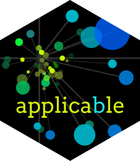 <a href="PNG/applicable.png">applicable.png</a> <a href="SVG/applicable.svg">applicable.svg</a>

</td>

<td>

 <a href="PNG/blastula.png">blastula.png</a> <a href="SVG/blastula.svg">blastula.svg</a>

</td>

<td>

 <a href="PNG/blogdown.png">blogdown.png</a> <a href="SVG/blogdown.svg">blogdown.svg</a>

</td>

<td>

 <a href="PNG/bookdown.png">bookdown.png</a> <a href="SVG/bookdown.svg">bookdown.svg</a>

</td>

<td>

 <a href="PNG/broom.png">broom.png</a> <a href="SVG/broom.svg">broom.svg</a>

</td>

</tr>

<tr>

<td>

 <a href="PNG/connectapi.png">connectapi.png</a> <a href="SVG/connectapi.svg">connectapi.svg</a>

</td>

<td>

 <a href="PNG/connections.png">connections.png</a> <a href="SVG/connections.svg">connections.svg</a>

</td>

<td>

 <a href="PNG/covr.png">covr.png</a> <a href="SVG/covr.svg">covr.svg</a>

</td>

<td>

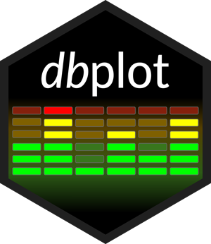 <a href="PNG/dbplot.png">dbplot.png</a> <a href="SVG/dbplot.svg">dbplot.svg</a>

</td>

<td>

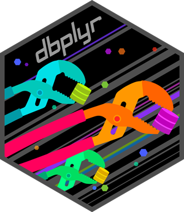 <a href="PNG/dbplyr.png">dbplyr.png</a> <a href="SVG/dbplyr.svg">dbplyr.svg</a>

</td>

</tr>

<tr>

<td>

 <a href="PNG/devtools.png">devtools.png</a> <a href="SVG/devtools.svg">devtools.svg</a>

</td>

<td>

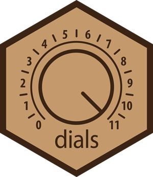 <a href="PNG/dials.png">dials.png</a> <a href="SVG/dials.svg">dials.svg</a>

</td>

<td>

 <a href="PNG/dplyr.png">dplyr.png</a> <a href="SVG/dplyr.svg">dplyr.svg</a>

</td>

<td>

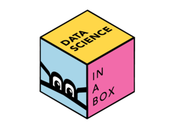 <a href="PNG/dsbox.png">dsbox.png</a> <a href="SVG/dsbox.svg">dsbox.svg</a>

</td>

<td>

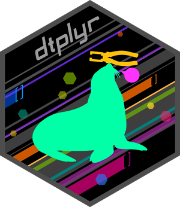 <a href="PNG/dtplyr.png">dtplyr.png</a> <a href="SVG/dtplyr.svg">dtplyr.svg</a>

</td>

</tr>

<tr>

<td>

 <a href="PNG/feather.png">feather.png</a> <a href="SVG/feather.svg">feather.svg</a>

</td>

<td>

 <a href="PNG/flexdashboard.png">flexdashboard.png</a> <a href="SVG/flexdashboard.svg">flexdashboard.svg</a>

</td>

<td>

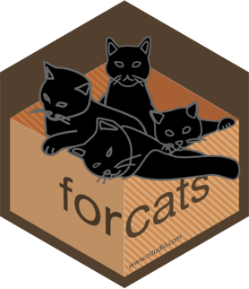 <a href="PNG/forcats.png">forcats.png</a> <a href="SVG/forcats.svg">forcats.svg</a>

</td>

<td>

 <a href="PNG/fs.png">fs.png</a> <a href="SVG/fs.svg">fs.svg</a>

</td>

<td>

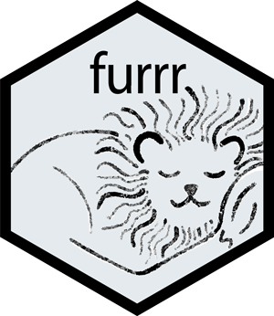 <a href="PNG/furrr.png">furrr.png</a> <a href="SVG/furrr.svg">furrr.svg</a>

</td>

</tr>

<tr>

<td>

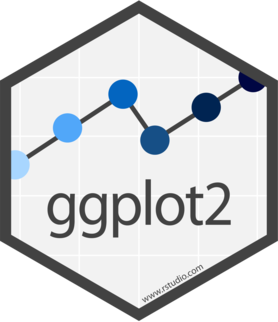 <a href="PNG/ggplot2.png">ggplot2.png</a> <a href="SVG/ggplot2.svg">ggplot2.svg</a>

</td>

<td>

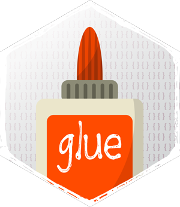 <a href="PNG/glue.png">glue.png</a> <a href="SVG/glue.svg">glue.svg</a>

</td>

<td>

 <a href="PNG/googledrive.png">googledrive.png</a> <a href="SVG/googledrive.svg">googledrive.svg</a>

</td>

<td>

 <a href="PNG/googlesheets.png">googlesheets.png</a> <a href="SVG/googlesheets.svg">googlesheets.svg</a>

</td>

<td>

 <a href="PNG/googlesheets4.png">googlesheets4.png</a> <a href="SVG/googlesheets4.svg">googlesheets4.svg</a>

</td>

</tr>

<tr>

<td>

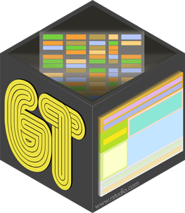 <a href="PNG/gt.png">gt.png</a> <a href="SVG/gt.svg">gt.svg</a>

</td>

<td>

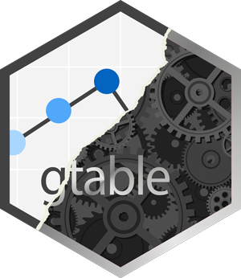 <a href="PNG/gtable.png">gtable.png</a> <a href="SVG/gtable.svg">gtable.svg</a>

</td>

<td>

 <a href="PNG/hardhat.png">hardhat.png</a> <a href="SVG/hardhat.svg">hardhat.svg</a>

</td>

<td>

 <a href="PNG/haven.png">haven.png</a> <a href="SVG/haven.svg">haven.svg</a>

</td>

<td>

 <a href="PNG/hms.png">hms.png</a> <a href="SVG/hms.svg">hms.svg</a>

</td>

</tr>

<tr>

<td>

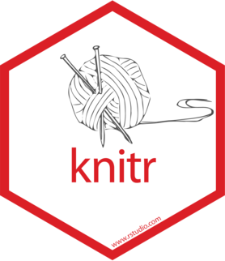 <a href="PNG/knitr.png">knitr.png</a> <a href="SVG/knitr.svg">knitr.svg</a>

</td>

<td>

 <a href="PNG/lobstr.png">lobstr.png</a> <a href="SVG/lobstr.svg">lobstr.svg</a>

</td>

<td>

 <a href="PNG/lubridate.png">lubridate.png</a> <a href="SVG/lubridate.svg">lubridate.svg</a>

</td>

<td>

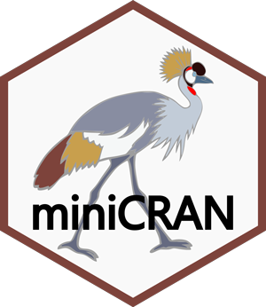 <a href="PNG/miniCRAN.png">miniCRAN.png</a> <a href="SVG/miniCRAN.svg">miniCRAN.svg</a>

</td>

<td>

 <a href="PNG/modeldb.png">modeldb.png</a> <a href="SVG/modeldb.svg">modeldb.svg</a>

</td>

</tr>

<tr>

<td>

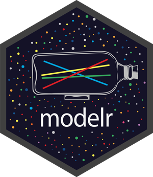 <a href="PNG/modelr.png">modelr.png</a> <a href="SVG/modelr.svg">modelr.svg</a>

</td>

<td>

 <a href="PNG/pagedown.png">pagedown.png</a> <a href="SVG/pagedown.svg">pagedown.svg</a>

</td>

<td>

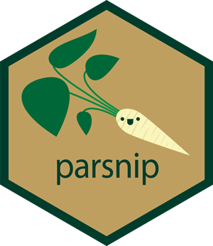 <a href="PNG/parsnip.png">parsnip.png</a> <a href="SVG/parsnip.svg">parsnip.svg</a>

</td>

<td>

 <a href="PNG/pins.png">pins.png</a> <a href="SVG/pins.svg">pins.svg</a>

</td>

<td>

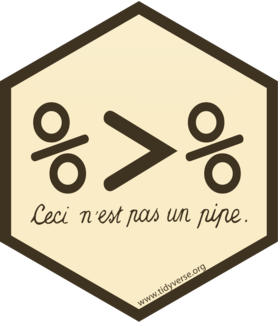 <a href="PNG/pipe.png">pipe.png</a> <a href="SVG/pipe.svg">pipe.svg</a>

</td>

</tr>

<tr>

<td>

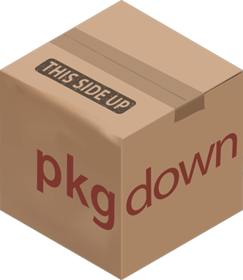 <a href="PNG/pkgdown.png">pkgdown.png</a> <a href="SVG/pkgdown.svg">pkgdown.svg</a>

</td>

<td>

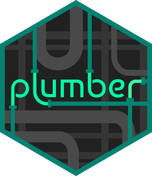 <a href="PNG/plumber.png">plumber.png</a> <a href="SVG/plumber.svg">plumber.svg</a>

</td>

<td>

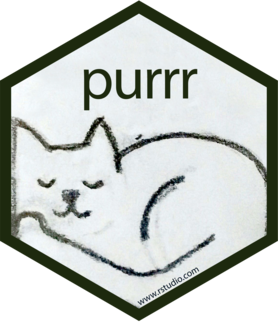 <a href="PNG/purrr.png">purrr.png</a> <a href="SVG/purrr.svg">purrr.svg</a>

</td>

<td>

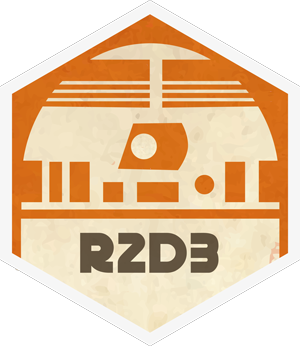 <a href="PNG/r2d3.png">r2d3.png</a> <a href="SVG/r2d3.svg">r2d3.svg</a>

</td>

<td>

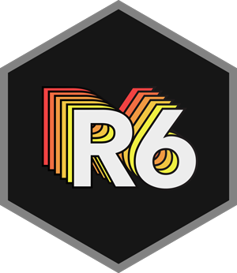 <a href="PNG/R6.png">R6.png</a> <a href="SVG/R6.svg">R6.svg</a>

</td>

</tr>

<tr>

<td>

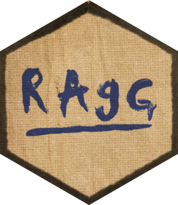 <a href="PNG/ragg.png">ragg.png</a> <a href="SVG/ragg.svg">ragg.svg</a>

</td>

<td>

 <a href="PNG/reactlog.png">reactlog.png</a> <a href="SVG/reactlog.svg">reactlog.svg</a>

</td>

<td>

 <a href="PNG/readr.png">readr.png</a> <a href="SVG/readr.svg">readr.svg</a>

</td>

<td>

 <a href="PNG/readxl.png">readxl.png</a> <a href="SVG/readxl.svg">readxl.svg</a>

</td>

<td>

 <a href="PNG/recipes.png">recipes.png</a> <a href="SVG/recipes.svg">recipes.svg</a>

</td>

</tr>

<tr>

<td>

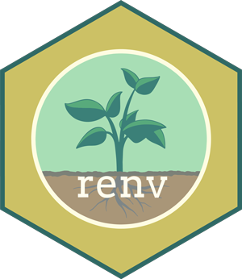 <a href="PNG/renv.png">renv.png</a> <a href="SVG/renv.svg">renv.svg</a>

</td>

<td>

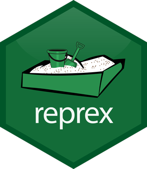 <a href="PNG/reprex.png">reprex.png</a> <a href="SVG/reprex.svg">reprex.svg</a>

</td>

<td>

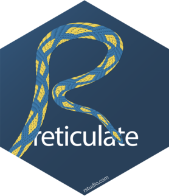 <a href="PNG/reticulate.png">reticulate.png</a> <a href="SVG/reticulate.svg">reticulate.svg</a>

</td>

<td>

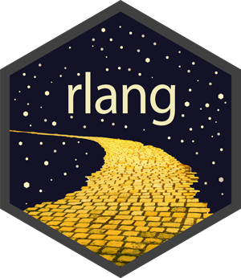 <a href="PNG/rlang.png">rlang.png</a> <a href="SVG/rlang.svg">rlang.svg</a>

</td>

<td>

 <a href="PNG/rmarkdown.png">rmarkdown.png</a> <a href="SVG/rmarkdown.svg">rmarkdown.svg</a>

</td>

</tr>

<tr>

<td>

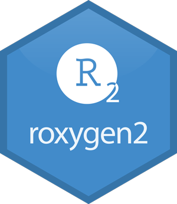 <a href="PNG/roxygen2.png">roxygen2.png</a> <a href="SVG/roxygen2.svg">roxygen2.svg</a>

</td>

<td>

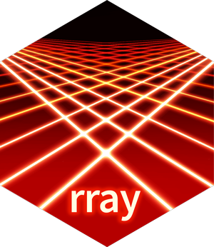 <a href="PNG/rray.png">rray.png</a> <a href="SVG/rray.svg">rray.svg</a>

</td>

<td>

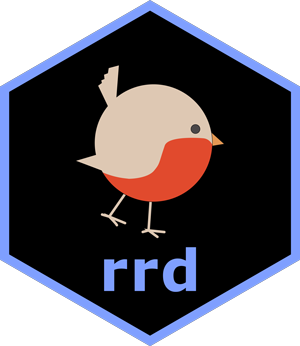 <a href="PNG/rrd.png">rrd.png</a> <a href="SVG/rrd.svg">rrd.svg</a>

</td>

<td>

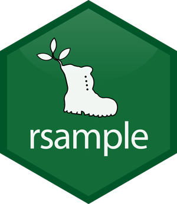 <a href="PNG/rsample.png">rsample.png</a> <a href="SVG/rsample.svg">rsample.svg</a>

</td>

<td>

 <a href="PNG/rsconnect.png">rsconnect.png</a> <a href="SVG/rsconnect.svg">rsconnect.svg</a>

</td>

</tr>

<tr>

<td>

 <a href="PNG/RStudio.png">RStudio.png</a> <a href="SVG/RStudio.svg">RStudio.svg</a>

</td>

<td>

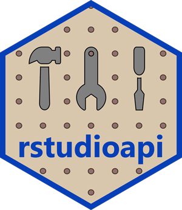 <a href="PNG/rstudioapi.png">rstudioapi.png</a> <a href="SVG/rstudioapi.svg">rstudioapi.svg</a>

</td>

<td>

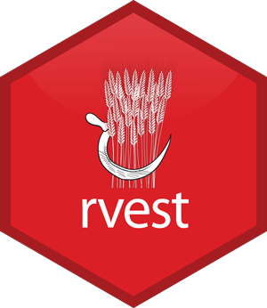 <a href="PNG/rvest.png">rvest.png</a> <a href="SVG/rvest.svg">rvest.svg</a>

</td>

<td>

 <a href="PNG/sass.png">sass.png</a> <a href="SVG/sass.svg">sass.svg</a>

</td>

<td>

 <a href="PNG/scales.png">scales.png</a> <a href="SVG/scales.svg">scales.svg</a>

</td>

</tr>

<tr>

<td>

 <a href="PNG/shiny.png">shiny.png</a> <a href="SVG/shiny.svg">shiny.svg</a>

</td>

<td>

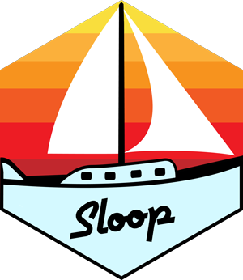 <a href="PNG/sloop.png">sloop.png</a> <a href="SVG/sloop.svg">sloop.svg</a>

</td>

<td>

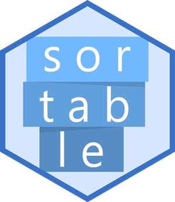 <a href="PNG/sortable.png">sortable.png</a> <a href="SVG/sortable.svg">sortable.svg</a>

</td>

<td>

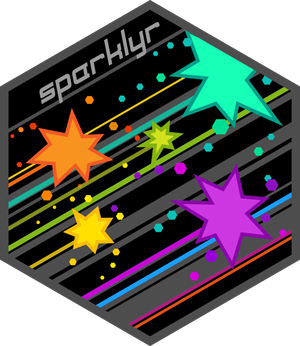 <a href="PNG/sparklyr.png">sparklyr.png</a> <a href="SVG/sparklyr.svg">sparklyr.svg</a>

</td>

<td>

 <a href="PNG/sss.png">sss.png</a> <a href="SVG/sss.svg">sss.svg</a>

</td>

</tr>

<tr>

<td>

 <a href="PNG/stringr.png">stringr.png</a> <a href="SVG/stringr.svg">stringr.svg</a>

</td>

<td>

 <a href="PNG/tensorflow.png">tensorflow.png</a> <a href="SVG/tensorflow.svg">tensorflow.svg</a>

</td>

<td>

 <a href="PNG/testthat.png">testthat.png</a> <a href="SVG/testthat.svg">testthat.svg</a>

</td>

<td>

 <a href="PNG/textrecipes.png">textrecipes.png</a> <a href="SVG/textrecipes.svg">textrecipes.svg</a>

</td>

<td>

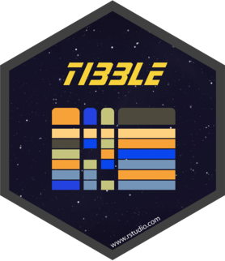 <a href="PNG/tibble.png">tibble.png</a> <a href="SVG/tibble.svg">tibble.svg</a>

</td>

</tr>

<tr>

<td>

 <a href="PNG/tidymodels.png">tidymodels.png</a> <a href="SVG/tidymodels.svg">tidymodels.svg</a>

</td>

<td>

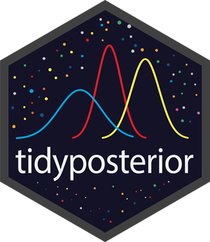 <a href="PNG/tidyposterior.png">tidyposterior.png</a> <a href="SVG/tidyposterior.svg">tidyposterior.svg</a>

</td>

<td>

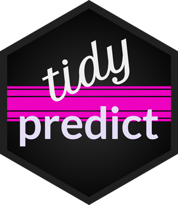 <a href="PNG/tidypredict.png">tidypredict.png</a> <a href="SVG/tidypredict.svg">tidypredict.svg</a>

</td>

<td>

 <a href="PNG/tidyr.png">tidyr.png</a> <a href="SVG/tidyr.svg">tidyr.svg</a>

</td>

<td>

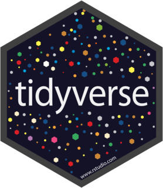 <a href="PNG/tidyverse.png">tidyverse.png</a> <a href="SVG/tidyverse.svg">tidyverse.svg</a>

</td>

</tr>

<tr>

<td>

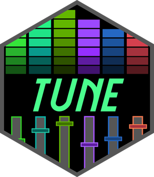 <a href="PNG/tune.png">tune.png</a> <a href="SVG/tune.svg">tune.svg</a>

</td>

<td>

 <a href="PNG/usethis.png">usethis.png</a> <a href="SVG/usethis.svg">usethis.svg</a>

</td>

<td>

 <a href="PNG/vctrs.png">vctrs.png</a> <a href="SVG/vctrs.svg">vctrs.svg</a>

</td>

<td>

 <a href="PNG/withr.png">withr.png</a> <a href="SVG/withr.svg">withr.svg</a>

</td>

<td>

 <a href="PNG/workflows.png">workflows.png</a> <a href="SVG/workflows.svg">workflows.svg</a>

</td>

</tr>

<tr>

<td>

 <a href="PNG/xaringan.png">xaringan.png</a> <a href="SVG/xaringan.svg">xaringan.svg</a>

</td>

<td>

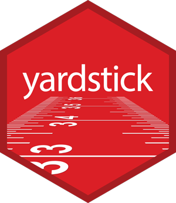 <a href="PNG/yardstick.png">yardstick.png</a> <a href="SVG/yardstick.svg">yardstick.svg</a>

</td>

</tr>

</table>

All stickers are licensed [CC0](LICENSE.md).
