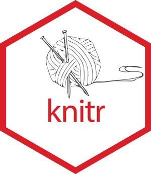
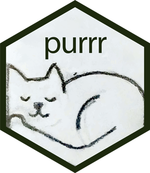
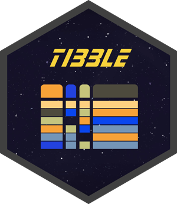

# hex-stickers

Want to buy a sticker? Many can be purchased from
<http://swag.rstudio.com/>. Or [see our instructions](./stickermule.md)
on how to print them yourself.

<table>

<tr>

<td>

 

\[<a href="PNG/applicable.png">.png</a>,
<a href="SVG/applicable.svg">.svg</a>\]

</td>

<td>

 

\[<a href="PNG/blastula.png">.png</a>,
<a href="SVG/blastula.svg">.svg</a>\]

</td>

<td>

 

\[<a href="PNG/blogdown.png">.png</a>,
<a href="SVG/blogdown.svg">.svg</a>\]

</td>

<td>

 

\[<a href="PNG/bookdown.png">.png</a>,
<a href="SVG/bookdown.svg">.svg</a>\]

</td>

<td>

 

\[<a href="PNG/broom.png">.png</a>, <a href="SVG/broom.svg">.svg</a>\]

</td>

</tr>

<tr>

<td>

 

\[<a href="PNG/connections.png">.png</a>,
<a href="SVG/connections.svg">.svg</a>\]

</td>

<td>

 

\[<a href="PNG/covr.png">.png</a>, <a href="SVG/covr.svg">.svg</a>\]

</td>

<td>

 

\[<a href="PNG/dbplot.png">.png</a>, <a href="SVG/dbplot.svg">.svg</a>\]

</td>

<td>

 

\[<a href="PNG/dbplyr.png">.png</a>, <a href="SVG/dbplyr.svg">.svg</a>\]

</td>

<td>

 

\[<a href="PNG/devtools.png">.png</a>,
<a href="SVG/devtools.svg">.svg</a>\]

</td>

</tr>

<tr>

<td>

 

\[<a href="PNG/dials.png">.png</a>, <a href="SVG/dials.svg">.svg</a>\]

</td>

<td>

 

\[<a href="PNG/dplyr.png">.png</a>, <a href="SVG/dplyr.svg">.svg</a>\]

</td>

<td>

 

\[<a href="PNG/dsbox.png">.png</a>, <a href="SVG/dsbox.svg">.svg</a>\]

</td>

<td>

 

\[<a href="PNG/dtplyr.png">.png</a>, <a href="SVG/dtplyr.svg">.svg</a>\]

</td>

<td>

 

\[<a href="PNG/feather.png">.png</a>,
<a href="SVG/feather.svg">.svg</a>\]

</td>

</tr>

<tr>

<td>

 

\[<a href="PNG/flexdashboard.png">.png</a>,
<a href="SVG/flexdashboard.svg">.svg</a>\]

</td>

<td>

 

\[<a href="PNG/forcats.png">.png</a>,
<a href="SVG/forcats.svg">.svg</a>\]

</td>

<td>

 

\[<a href="PNG/fs.png">.png</a>, <a href="SVG/fs.svg">.svg</a>\]

</td>

<td>

 

\[<a href="PNG/furrr.png">.png</a>, <a href="SVG/furrr.svg">.svg</a>\]

</td>

<td>

 

\[<a href="PNG/ggplot2.png">.png</a>,
<a href="SVG/ggplot2.svg">.svg</a>\]

</td>

</tr>

<tr>

<td>

 

\[<a href="PNG/glue.png">.png</a>, <a href="SVG/glue.svg">.svg</a>\]

</td>

<td>

 

\[<a href="PNG/googledrive.png">.png</a>,
<a href="SVG/googledrive.svg">.svg</a>\]

</td>

<td>

 

\[<a href="PNG/googlesheets.png">.png</a>,
<a href="SVG/googlesheets.svg">.svg</a>\]

</td>

<td>

 

\[<a href="PNG/googlesheets4.png">.png</a>,
<a href="SVG/googlesheets4.svg">.svg</a>\]

</td>

<td>

 

\[<a href="PNG/gt.png">.png</a>, <a href="SVG/gt.svg">.svg</a>\]

</td>

</tr>

<tr>

<td>

 

\[<a href="PNG/gtable.png">.png</a>, <a href="SVG/gtable.svg">.svg</a>\]

</td>

<td>

 

\[<a href="PNG/hardhat.png">.png</a>,
<a href="SVG/hardhat.svg">.svg</a>\]

</td>

<td>

 

\[<a href="PNG/haven.png">.png</a>, <a href="SVG/haven.svg">.svg</a>\]

</td>

<td>

 

\[<a href="PNG/hms.png">.png</a>, <a href="SVG/hms.svg">.svg</a>\]

</td>

<td>

 

\[<a href="PNG/knitr.png">.png</a>, <a href="SVG/knitr.svg">.svg</a>\]

</td>

</tr>

<tr>

<td>

 

\[<a href="PNG/lobstr.png">.png</a>, <a href="SVG/lobstr.svg">.svg</a>\]

</td>

<td>

 

\[<a href="PNG/lubridate.png">.png</a>,
<a href="SVG/lubridate.svg">.svg</a>\]

</td>

<td>

 

\[<a href="PNG/modeldb.png">.png</a>,
<a href="SVG/modeldb.svg">.svg</a>\]

</td>

<td>

 

\[<a href="PNG/modelr.png">.png</a>, <a href="SVG/modelr.svg">.svg</a>\]

</td>

<td>

 

\[<a href="PNG/pagedown.png">.png</a>,
<a href="SVG/pagedown.svg">.svg</a>\]

</td>

</tr>

<tr>

<td>

 

\[<a href="PNG/parsnip.png">.png</a>,
<a href="SVG/parsnip.svg">.svg</a>\]

</td>

<td>

 

\[<a href="PNG/pins.png">.png</a>, <a href="SVG/pins.svg">.svg</a>\]

</td>

<td>

 

\[<a href="PNG/pipe.png">.png</a>, <a href="SVG/pipe.svg">.svg</a>\]

</td>

<td>

 

\[<a href="PNG/pkgdown.png">.png</a>,
<a href="SVG/pkgdown.svg">.svg</a>\]

</td>

<td>

 

\[<a href="PNG/plumber-female.png">.png</a>,
<a href="SVG/plumber-female.svg">.svg</a>\]

</td>

</tr>

<tr>

<td>

 

\[<a href="PNG/purrr.png">.png</a>, <a href="SVG/purrr.svg">.svg</a>\]

</td>

<td>

 

\[<a href="PNG/r2d3.png">.png</a>, <a href="SVG/r2d3.svg">.svg</a>\]

</td>

<td>

 

\[<a href="PNG/R6.png">.png</a>, <a href="SVG/R6.svg">.svg</a>\]

</td>

<td>

 

\[<a href="PNG/ragg.png">.png</a>, <a href="SVG/ragg.svg">.svg</a>\]

</td>

<td>

 

\[<a href="PNG/readr.png">.png</a>, <a href="SVG/readr.svg">.svg</a>\]

</td>

</tr>

<tr>

<td>

 

\[<a href="PNG/readxl.png">.png</a>, <a href="SVG/readxl.svg">.svg</a>\]

</td>

<td>

 

\[<a href="PNG/recipes.png">.png</a>,
<a href="SVG/recipes.svg">.svg</a>\]

</td>

<td>

 

\[<a href="PNG/renv.png">.png</a>, <a href="SVG/renv.svg">.svg</a>\]

</td>

<td>

 

\[<a href="PNG/reprex.png">.png</a>, <a href="SVG/reprex.svg">.svg</a>\]

</td>

<td>

 

\[<a href="PNG/reticulate.png">.png</a>,
<a href="SVG/reticulate.svg">.svg</a>\]

</td>

</tr>

<tr>

<td>

 

\[<a href="PNG/rlang.png">.png</a>, <a href="SVG/rlang.svg">.svg</a>\]

</td>

<td>

 

\[<a href="PNG/rmarkdown.png">.png</a>,
<a href="SVG/rmarkdown.svg">.svg</a>\]

</td>

<td>

 

\[<a href="PNG/roxygen2.png">.png</a>,
<a href="SVG/roxygen2.svg">.svg</a>\]

</td>

<td>

 

\[<a href="PNG/rray.png">.png</a>, <a href="SVG/rray.svg">.svg</a>\]

</td>

<td>

 

\[<a href="PNG/rsample.png">.png</a>,
<a href="SVG/rsample.svg">.svg</a>\]

</td>

</tr>

<tr>

<td>

 

\[<a href="PNG/RStudio.png">.png</a>,
<a href="SVG/RStudio.svg">.svg</a>\]

</td>

<td>

 

\[<a href="PNG/rvest.png">.png</a>, <a href="SVG/rvest.svg">.svg</a>\]

</td>

<td>

 

\[<a href="PNG/scales.png">.png</a>, <a href="SVG/scales.svg">.svg</a>\]

</td>

<td>

 

\[<a href="PNG/shiny.png">.png</a>, <a href="SVG/shiny.svg">.svg</a>\]

</td>

<td>

 

\[<a href="PNG/sloop.png">.png</a>, <a href="SVG/sloop.svg">.svg</a>\]

</td>

</tr>

<tr>

<td>

 

\[<a href="PNG/sparklyr.png">.png</a>,
<a href="SVG/sparklyr.svg">.svg</a>\]

</td>

<td>

 

\[<a href="PNG/stringr.png">.png</a>,
<a href="SVG/stringr.svg">.svg</a>\]

</td>

<td>

 

\[<a href="PNG/tensorflow.png">.png</a>,
<a href="SVG/tensorflow.svg">.svg</a>\]

</td>

<td>

 

\[<a href="PNG/testthat.png">.png</a>,
<a href="SVG/testthat.svg">.svg</a>\]

</td>

<td>

 

\[<a href="PNG/textrecipes.png">.png</a>,
<a href="SVG/textrecipes.svg">.svg</a>\]

</td>

</tr>

<tr>

<td>

 

\[<a href="PNG/tibble.png">.png</a>, <a href="SVG/tibble.svg">.svg</a>\]

</td>

<td>

 

\[<a href="PNG/tidymodels.png">.png</a>,
<a href="SVG/tidymodels.svg">.svg</a>\]

</td>

<td>

 

\[<a href="PNG/tidyposterior.png">.png</a>,
<a href="SVG/tidyposterior.svg">.svg</a>\]

</td>

<td>

 

\[<a href="PNG/tidypredict.png">.png</a>,
<a href="SVG/tidypredict.svg">.svg</a>\]

</td>

<td>

 

\[<a href="PNG/tidyr.png">.png</a>, <a href="SVG/tidyr.svg">.svg</a>\]

</td>

</tr>

<tr>

<td>

 

\[<a href="PNG/tidyverse.png">.png</a>,
<a href="SVG/tidyverse.svg">.svg</a>\]

</td>

<td>

 

\[<a href="PNG/tune.png">.png</a>, <a href="SVG/tune.svg">.svg</a>\]

</td>

<td>

 

\[<a href="PNG/usethis.png">.png</a>,
<a href="SVG/usethis.svg">.svg</a>\]

</td>

<td>

 

\[<a href="PNG/vctrs.png">.png</a>, <a href="SVG/vctrs.svg">.svg</a>\]

</td>

<td>

 

\[<a href="PNG/withr.png">.png</a>, <a href="SVG/withr.svg">.svg</a>\]

</td>

</tr>

<tr>

<td>

 

\[<a href="PNG/workflows.png">.png</a>,
<a href="SVG/workflows.svg">.svg</a>\]

</td>

<td>

 

\[<a href="PNG/xaringan.png">.png</a>,
<a href="SVG/xaringan.svg">.svg</a>\]

</td>

<td>

 

\[<a href="PNG/yardstick.png">.png</a>,
<a href="SVG/yardstick.svg">.svg</a>\]

</td>

</tr>

</table>

All stickers are licensed [CC0](LICENSE.md).
