# RStudio hex stickers

Want to buy a sticker? Many can be purchased from
<http://swag.rstudio.com/>. Or [see our instructions](#printing) on how
to print them yourself.

<table>
<tr>
<td>
 <a href="PNG/applicable.png">applicable.png</a> <a href="SVG/applicable.svg">applicable.svg</a>
</td>
<td>
 <a href="PNG/ark.png">ark.png</a> <a href="SVG/ark.svg">ark.svg</a>
</td>
<td>
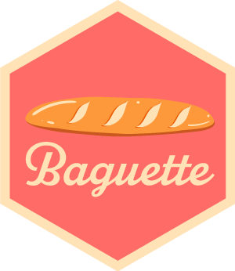 <a href="PNG/baguette.png">baguette.png</a> <a href="SVG/baguette.svg">baguette.svg</a>
</td>
<td>
 <a href="PNG/blastula.png">blastula.png</a> <a href="SVG/blastula.svg">blastula.svg</a>
</td>
<td>
 <a href="PNG/blogdown.png">blogdown.png</a> <a href="SVG/blogdown.svg">blogdown.svg</a>
</td>
</tr>
<tr>
<td>
 <a href="PNG/bonsai.png">bonsai.png</a> <a href="SVG/bonsai.svg">bonsai.svg</a>
</td>
<td>
 <a href="PNG/bookdown.png">bookdown.png</a> <a href="SVG/bookdown.svg">bookdown.svg</a>
</td>
<td>
 <a href="PNG/broom.png">broom.png</a> <a href="SVG/broom.svg">broom.svg</a>
</td>
<td>
 <a href="PNG/bslib.png">bslib.png</a> <a href="SVG/bslib.svg">bslib.svg</a>
</td>
<td>
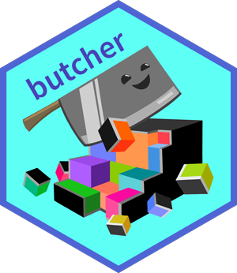 <a href="PNG/butcher.png">butcher.png</a> <a href="SVG/butcher.svg">butcher.svg</a>
</td>
</tr>
<tr>
<td>
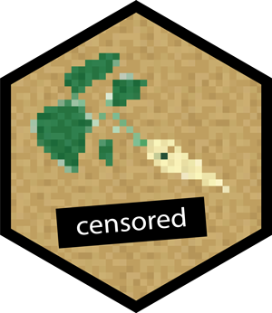 <a href="PNG/censored.png">censored.png</a> <a href="SVG/censored.svg">censored.svg</a>
</td>
<td>
 <a href="PNG/chattr.png">chattr.png</a> <a href="SVG/chattr.svg">chattr.svg</a>
</td>
<td>
 <a href="PNG/chromote.png">chromote.png</a> <a href="SVG/chromote.svg">chromote.svg</a>
</td>
<td>
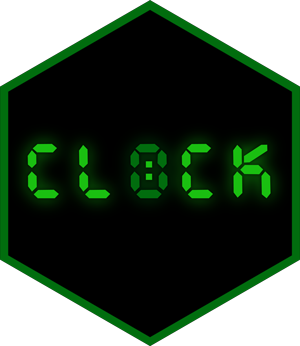 <a href="PNG/clock.png">clock.png</a> <a href="SVG/clock.svg">clock.svg</a>
</td>
<td>
 <a href="PNG/connectapi.png">connectapi.png</a> <a href="SVG/connectapi.svg">connectapi.svg</a>
</td>
</tr>
<tr>
<td>
 <a href="PNG/connections.png">connections.png</a> <a href="SVG/connections.svg">connections.svg</a>
</td>
<td>
 <a href="PNG/covr.png">covr.png</a> <a href="SVG/covr.svg">covr.svg</a>
</td>
<td>
 <a href="PNG/dbplot.png">dbplot.png</a> <a href="SVG/dbplot.svg">dbplot.svg</a>
</td>
<td>
 <a href="PNG/dbplyr.png">dbplyr.png</a> <a href="SVG/dbplyr.svg">dbplyr.svg</a>
</td>
<td>
 <a href="PNG/devtools.png">devtools.png</a> <a href="SVG/devtools.svg">devtools.svg</a>
</td>
</tr>
<tr>
<td>
 <a href="PNG/dials.png">dials.png</a> <a href="SVG/dials.svg">dials.svg</a>
</td>
<td>
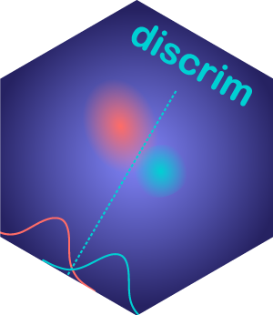 <a href="PNG/discrim.png">discrim.png</a> <a href="SVG/discrim.svg">discrim.svg</a>
</td>
<td>
 <a href="PNG/distill.png">distill.png</a> <a href="SVG/distill.svg">distill.svg</a>
</td>
<td>
 <a href="PNG/dplyr.png">dplyr.png</a> <a href="SVG/dplyr.svg">dplyr.svg</a>
</td>
<td>
 <a href="PNG/dsbox.png">dsbox.png</a> <a href="SVG/dsbox.svg">dsbox.svg</a>
</td>
</tr>
<tr>
<td>
 <a href="PNG/dtplyr.png">dtplyr.png</a> <a href="SVG/dtplyr.svg">dtplyr.svg</a>
</td>
<td>
 <a href="PNG/duckplyr.png">duckplyr.png</a> <a href="SVG/duckplyr.svg">duckplyr.svg</a>
</td>
<td>
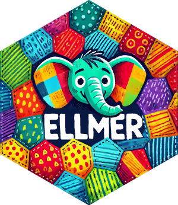 <a href="PNG/ellmer.png">ellmer.png</a> <a href="SVG/ellmer.svg">ellmer.svg</a>
</td>
<td>
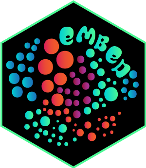 <a href="PNG/embed.png">embed.png</a> <a href="SVG/embed.svg">embed.svg</a>
</td>
<td>
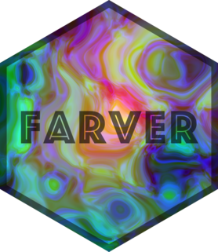 <a href="PNG/farver.png">farver.png</a> <a href="SVG/farver.svg">farver.svg</a>
</td>
</tr>
<tr>
<td>
 <a href="PNG/feather.png">feather.png</a> <a href="SVG/feather.svg">feather.svg</a>
</td>
<td>
 <a href="PNG/finetune.png">finetune.png</a> <a href="SVG/finetune.svg">finetune.svg</a>
</td>
<td>
 <a href="PNG/flexdashboard.png">flexdashboard.png</a> <a href="SVG/flexdashboard.svg">flexdashboard.svg</a>
</td>
<td>
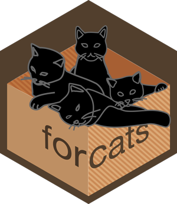 <a href="PNG/forcats.png">forcats.png</a> <a href="SVG/forcats.svg">forcats.svg</a>
</td>
<td>
 <a href="PNG/fs.png">fs.png</a> <a href="SVG/fs.svg">fs.svg</a>
</td>
</tr>
<tr>
<td>
 <a href="PNG/furrr.png">furrr.png</a> <a href="SVG/furrr.svg">furrr.svg</a>
</td>
<td>
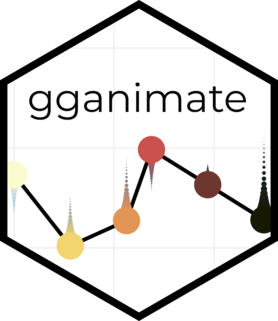 <a href="PNG/gganimate.png">gganimate.png</a> <a href="SVG/gganimate.svg">gganimate.svg</a>
</td>
<td>
 <a href="PNG/ggplot2.png">ggplot2.png</a> <a href="SVG/ggplot2.svg">ggplot2.svg</a>
</td>
<td>
 <a href="PNG/glue.png">glue.png</a> <a href="SVG/glue.svg">glue.svg</a>
</td>
<td>
 <a href="PNG/googledrive.png">googledrive.png</a> <a href="SVG/googledrive.svg">googledrive.svg</a>
</td>
</tr>
<tr>
<td>
 <a href="PNG/googlesheets.png">googlesheets.png</a> <a href="SVG/googlesheets.svg">googlesheets.svg</a>
</td>
<td>
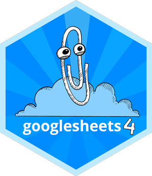 <a href="PNG/googlesheets4.png">googlesheets4.png</a> <a href="SVG/googlesheets4.svg">googlesheets4.svg</a>
</td>
<td>
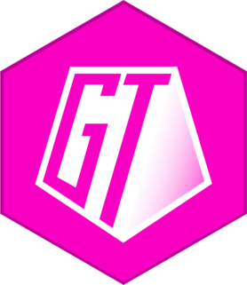 <a href="PNG/great_tables.png">great_tables.png</a> <a href="SVG/great_tables.svg">great_tables.svg</a>
</td>
<td>
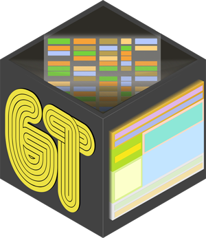 <a href="PNG/gt.png">gt.png</a> <a href="SVG/gt.svg">gt.svg</a>
</td>
<td>
 <a href="PNG/gtable.png">gtable.png</a> <a href="SVG/gtable.svg">gtable.svg</a>
</td>
</tr>
<tr>
<td>
 <a href="PNG/hardhat.png">hardhat.png</a> <a href="SVG/hardhat.svg">hardhat.svg</a>
</td>
<td>
 <a href="PNG/haven.png">haven.png</a> <a href="SVG/haven.svg">haven.svg</a>
</td>
<td>
 <a href="PNG/hms.png">hms.png</a> <a href="SVG/hms.svg">hms.svg</a>
</td>
<td>
 <a href="PNG/htmltools.png">htmltools.png</a> <a href="SVG/htmltools.svg">htmltools.svg</a>
</td>
<td>
 <a href="PNG/httr2.png">httr2.png</a> <a href="SVG/httr2.svg">httr2.svg</a>
</td>
</tr>
<tr>
<td>
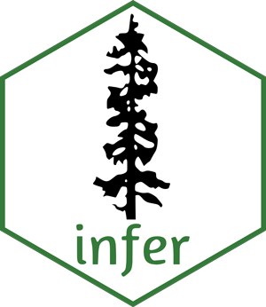 <a href="PNG/infer.png">infer.png</a> <a href="SVG/infer.svg">infer.svg</a>
</td>
<td>
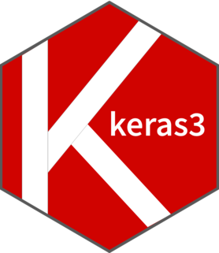 <a href="PNG/keras3.png">keras3.png</a> <a href="SVG/keras3.svg">keras3.svg</a>
</td>
<td>
 <a href="PNG/knitr.png">knitr.png</a> <a href="SVG/knitr.svg">knitr.svg</a>
</td>
<td>
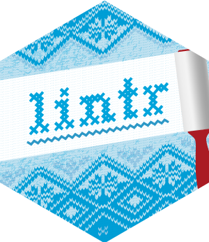 <a href="PNG/lintr.png">lintr.png</a> <a href="SVG/lintr.svg">lintr.svg</a>
</td>
<td>
 <a href="PNG/lobstr.png">lobstr.png</a> <a href="SVG/lobstr.svg">lobstr.svg</a>
</td>
</tr>
<tr>
<td>
 <a href="PNG/lubridate.png">lubridate.png</a> <a href="SVG/lubridate.svg">lubridate.svg</a>
</td>
<td>
 <a href="PNG/luz.png">luz.png</a> <a href="SVG/luz.svg">luz.svg</a>
</td>
<td>
 <a href="PNG/mall.png">mall.png</a> <a href="SVG/mall.svg">mall.svg</a>
</td>
<td>
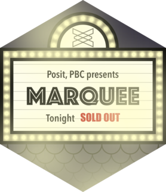 <a href="PNG/marquee.png">marquee.png</a> <a href="SVG/marquee.svg">marquee.svg</a>
</td>
<td>
 <a href="PNG/miniCRAN.png">miniCRAN.png</a> <a href="SVG/miniCRAN.svg">miniCRAN.svg</a>
</td>
</tr>
<tr>
<td>
 <a href="PNG/modeldb.png">modeldb.png</a> <a href="SVG/modeldb.svg">modeldb.svg</a>
</td>
<td>
 <a href="PNG/modelr.png">modelr.png</a> <a href="SVG/modelr.svg">modelr.svg</a>
</td>
<td>
 <a href="PNG/multilevelmod.png">multilevelmod.png</a> <a href="SVG/multilevelmod.svg">multilevelmod.svg</a>
</td>
<td>
 <a href="PNG/odbc.png">odbc.png</a> <a href="SVG/odbc.svg">odbc.svg</a>
</td>
<td>
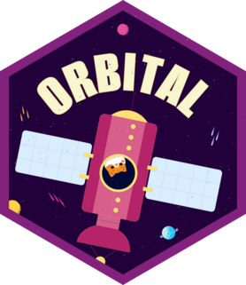 <a href="PNG/orbital.png">orbital.png</a> <a href="SVG/orbital.svg">orbital.svg</a>
</td>
</tr>
<tr>
<td>
 <a href="PNG/pagedown.png">pagedown.png</a> <a href="SVG/pagedown.svg">pagedown.svg</a>
</td>
<td>
 <a href="PNG/parsnip.png">parsnip.png</a> <a href="SVG/parsnip.svg">parsnip.svg</a>
</td>
<td>
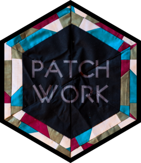 <a href="PNG/patchwork.png">patchwork.png</a> <a href="SVG/patchwork.svg">patchwork.svg</a>
</td>
<td>
 <a href="PNG/pins.png">pins.png</a> <a href="SVG/pins.svg">pins.svg</a>
</td>
<td>
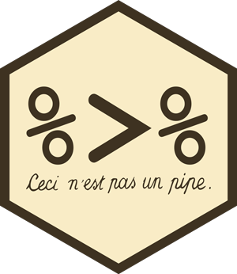 <a href="PNG/pipe.png">pipe.png</a> <a href="SVG/pipe.svg">pipe.svg</a>
</td>
</tr>
<tr>
<td>
 <a href="PNG/pkgdown.png">pkgdown.png</a> <a href="SVG/pkgdown.svg">pkgdown.svg</a>
</td>
<td>
 <a href="PNG/plotnine.png">plotnine.png</a> <a href="SVG/plotnine.svg">plotnine.svg</a>
</td>
<td>
 <a href="PNG/plumber.png">plumber.png</a> <a href="SVG/plumber.svg">plumber.svg</a>
</td>
<td>
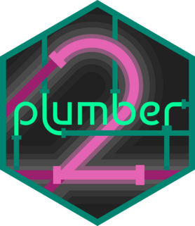 <a href="PNG/plumber2.png">plumber2.png</a> <a href="SVG/plumber2.svg">plumber2.svg</a>
</td>
<td>
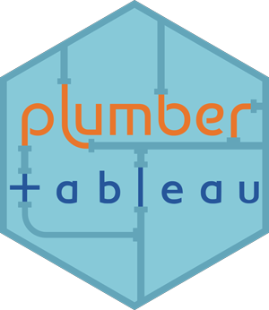 <a href="PNG/plumbertableau.png">plumbertableau.png</a> <a href="SVG/plumbertableau.svg">plumbertableau.svg</a>
</td>
</tr>
<tr>
<td>
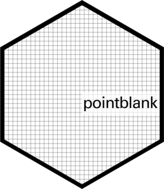 <a href="PNG/pointblank.png">pointblank.png</a> <a href="SVG/pointblank.svg">pointblank.svg</a>
</td>
<td>
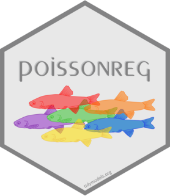 <a href="PNG/poissonreg.png">poissonreg.png</a> <a href="SVG/poissonreg.svg">poissonreg.svg</a>
</td>
<td>
 <a href="PNG/positron.png">positron.png</a> <a href="SVG/positron.svg">positron.svg</a>
</td>
<td>
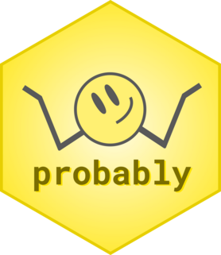 <a href="PNG/probably.png">probably.png</a> <a href="SVG/probably.svg">probably.svg</a>
</td>
<td>
 <a href="PNG/purrr.png">purrr.png</a> <a href="SVG/purrr.svg">purrr.svg</a>
</td>
</tr>
<tr>
<td>
 <a href="PNG/quarto.png">quarto.png</a> <a href="SVG/quarto.svg">quarto.svg</a>
</td>
<td>
 <a href="PNG/r2d3.png">r2d3.png</a> <a href="SVG/r2d3.svg">r2d3.svg</a>
</td>
<td>
 <a href="PNG/R6.png">R6.png</a> <a href="SVG/R6.svg">R6.svg</a>
</td>
<td>
 <a href="PNG/ragg.png">ragg.png</a> <a href="SVG/ragg.svg">ragg.svg</a>
</td>
<td>
 <a href="PNG/rapp.png">rapp.png</a> <a href="SVG/rapp.svg">rapp.svg</a>
</td>
</tr>
<tr>
<td>
 <a href="PNG/reactlog.png">reactlog.png</a> <a href="SVG/reactlog.svg">reactlog.svg</a>
</td>
<td>
 <a href="PNG/readr.png">readr.png</a> <a href="SVG/readr.svg">readr.svg</a>
</td>
<td>
 <a href="PNG/readxl.png">readxl.png</a> <a href="SVG/readxl.svg">readxl.svg</a>
</td>
<td>
 <a href="PNG/recipes.png">recipes.png</a> <a href="SVG/recipes.svg">recipes.svg</a>
</td>
<td>
 <a href="PNG/renv.png">renv.png</a> <a href="SVG/renv.svg">renv.svg</a>
</td>
</tr>
<tr>
<td>
 <a href="PNG/reprex.png">reprex.png</a> <a href="SVG/reprex.svg">reprex.svg</a>
</td>
<td>
 <a href="PNG/reticulate.png">reticulate.png</a> <a href="SVG/reticulate.svg">reticulate.svg</a>
</td>
<td>
 <a href="PNG/rlang.png">rlang.png</a> <a href="SVG/rlang.svg">rlang.svg</a>
</td>
<td>
 <a href="PNG/rmarkdown.png">rmarkdown.png</a> <a href="SVG/rmarkdown.svg">rmarkdown.svg</a>
</td>
<td>
 <a href="PNG/roxygen2.png">roxygen2.png</a> <a href="SVG/roxygen2.svg">roxygen2.svg</a>
</td>
</tr>
<tr>
<td>
 <a href="PNG/rray.png">rray.png</a> <a href="SVG/rray.svg">rray.svg</a>
</td>
<td>
 <a href="PNG/rrd.png">rrd.png</a> <a href="SVG/rrd.svg">rrd.svg</a>
</td>
<td>
 <a href="PNG/rsample.png">rsample.png</a> <a href="SVG/rsample.svg">rsample.svg</a>
</td>
<td>
 <a href="PNG/rsconnect.png">rsconnect.png</a> <a href="SVG/rsconnect.svg">rsconnect.svg</a>
</td>
<td>
 <a href="PNG/RStudio.png">RStudio.png</a> <a href="SVG/RStudio.svg">RStudio.svg</a>
</td>
</tr>
<tr>
<td>
 <a href="PNG/rstudioapi.png">rstudioapi.png</a> <a href="SVG/rstudioapi.svg">rstudioapi.svg</a>
</td>
<td>
 <a href="PNG/rticles.png">rticles.png</a> <a href="SVG/rticles.svg">rticles.svg</a>
</td>
<td>
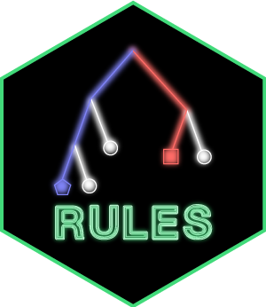 <a href="PNG/rules.png">rules.png</a> <a href="SVG/rules.svg">rules.svg</a>
</td>
<td>
 <a href="PNG/rvest.png">rvest.png</a> <a href="SVG/rvest.svg">rvest.svg</a>
</td>
<td>
 <a href="PNG/rwasm.png">rwasm.png</a> <a href="SVG/rwasm.svg">rwasm.svg</a>
</td>
</tr>
<tr>
<td>
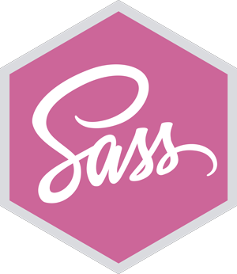 <a href="PNG/sass.png">sass.png</a> <a href="SVG/sass.svg">sass.svg</a>
</td>
<td>
 <a href="PNG/scales.png">scales.png</a> <a href="SVG/scales.svg">scales.svg</a>
</td>
<td>
 <a href="PNG/shiny.png">shiny.png</a> <a href="SVG/shiny.svg">shiny.svg</a>
</td>
<td>
 <a href="PNG/shinychat.png">shinychat.png</a> <a href="SVG/shinychat.svg">shinychat.svg</a>
</td>
<td>
 <a href="PNG/shinytest2.png">shinytest2.png</a> <a href="SVG/shinytest2.svg">shinytest2.svg</a>
</td>
</tr>
<tr>
<td>
 <a href="PNG/siuba.png">siuba.png</a> <a href="SVG/siuba.svg">siuba.svg</a>
</td>
<td>
 <a href="PNG/sloop.png">sloop.png</a> <a href="SVG/sloop.svg">sloop.svg</a>
</td>
<td>
 <a href="PNG/sortable.png">sortable.png</a> <a href="SVG/sortable.svg">sortable.svg</a>
</td>
<td>
 <a href="PNG/sparklyr.png">sparklyr.png</a> <a href="SVG/sparklyr.svg">sparklyr.svg</a>
</td>
<td>
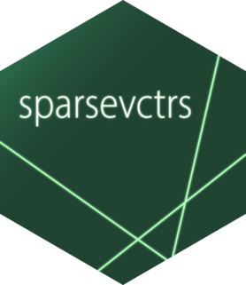 <a href="PNG/sparsevctrs.png">sparsevctrs.png</a> <a href="SVG/sparsevctrs.svg">sparsevctrs.svg</a>
</td>
</tr>
<tr>
<td>
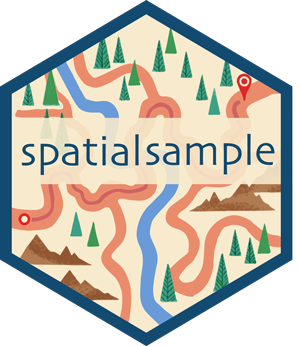 <a href="PNG/spatialsample.png">spatialsample.png</a> <a href="SVG/spatialsample.svg">spatialsample.svg</a>
</td>
<td>
 <a href="PNG/sss.png">sss.png</a> <a href="SVG/sss.svg">sss.svg</a>
</td>
<td>
 <a href="PNG/stacks.png">stacks.png</a> <a href="SVG/stacks.svg">stacks.svg</a>
</td>
<td>
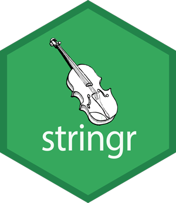 <a href="PNG/stringr.png">stringr.png</a> <a href="SVG/stringr.svg">stringr.svg</a>
</td>
<td>
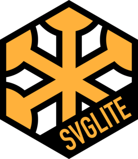 <a href="PNG/svglite.png">svglite.png</a> <a href="SVG/svglite.svg">svglite.svg</a>
</td>
</tr>
<tr>
<td>
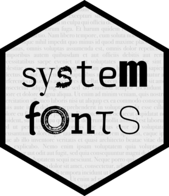 <a href="PNG/systemfonts.png">systemfonts.png</a> <a href="SVG/systemfonts.svg">systemfonts.svg</a>
</td>
<td>
 <a href="PNG/tensorflow.png">tensorflow.png</a> <a href="SVG/tensorflow.svg">tensorflow.svg</a>
</td>
<td>
 <a href="PNG/testthat.png">testthat.png</a> <a href="SVG/testthat.svg">testthat.svg</a>
</td>
<td>
 <a href="PNG/textrecipes.png">textrecipes.png</a> <a href="SVG/textrecipes.svg">textrecipes.svg</a>
</td>
<td>
 <a href="PNG/themis.png">themis.png</a> <a href="SVG/themis.svg">themis.svg</a>
</td>
</tr>
<tr>
<td>
 <a href="PNG/tibble.png">tibble.png</a> <a href="SVG/tibble.svg">tibble.svg</a>
</td>
<td>
 <a href="PNG/tidyclust.png">tidyclust.png</a> <a href="SVG/tidyclust.svg">tidyclust.svg</a>
</td>
<td>
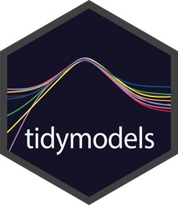 <a href="PNG/tidymodels.png">tidymodels.png</a> <a href="SVG/tidymodels.svg">tidymodels.svg</a>
</td>
<td>
 <a href="PNG/tidyposterior.png">tidyposterior.png</a> <a href="SVG/tidyposterior.svg">tidyposterior.svg</a>
</td>
<td>
 <a href="PNG/tidypredict.png">tidypredict.png</a> <a href="SVG/tidypredict.svg">tidypredict.svg</a>
</td>
</tr>
<tr>
<td>
 <a href="PNG/tidyr.png">tidyr.png</a> <a href="SVG/tidyr.svg">tidyr.svg</a>
</td>
<td>
 <a href="PNG/tidyverse.png">tidyverse.png</a> <a href="SVG/tidyverse.svg">tidyverse.svg</a>
</td>
<td>
 <a href="PNG/torch.png">torch.png</a> <a href="SVG/torch.svg">torch.svg</a>
</td>
<td>
 <a href="PNG/tune.png">tune.png</a> <a href="SVG/tune.svg">tune.svg</a>
</td>
<td>
 <a href="PNG/usethis.png">usethis.png</a> <a href="SVG/usethis.svg">usethis.svg</a>
</td>
</tr>
<tr>
<td>
 <a href="PNG/vctrs.png">vctrs.png</a> <a href="SVG/vctrs.svg">vctrs.svg</a>
</td>
<td>
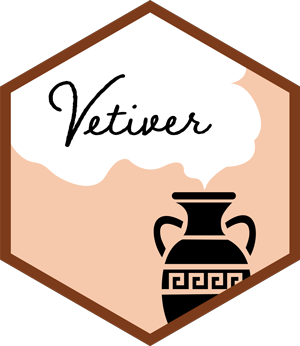 <a href="PNG/vetiver.png">vetiver.png</a> <a href="SVG/vetiver.svg">vetiver.svg</a>
</td>
<td>
 <a href="PNG/webr.png">webr.png</a> <a href="SVG/webr.svg">webr.svg</a>
</td>
<td>
 <a href="PNG/withr.png">withr.png</a> <a href="SVG/withr.svg">withr.svg</a>
</td>
<td>
 <a href="PNG/workflows.png">workflows.png</a> <a href="SVG/workflows.svg">workflows.svg</a>
</td>
</tr>
<tr>
<td>
 <a href="PNG/xaringan.png">xaringan.png</a> <a href="SVG/xaringan.svg">xaringan.svg</a>
</td>
<td>
 <a href="PNG/yardstick.png">yardstick.png</a> <a href="SVG/yardstick.svg">yardstick.svg</a>
</td>
</tr>
</table>

All stickers are licensed [CC0](LICENSE.md).

## Printing

Look for a company that offers die-cut stickers. We recommend using the
PNG version of the sticker. The printed stickers should be 1.74” x 2”.

If you use the SVG version:

- Specify colors as CMYK using the U.S. Web Coated (SWOP) v2 profile.
- Save a copy of your final sticker and convert all text to outlines to
  avoid font problems.
